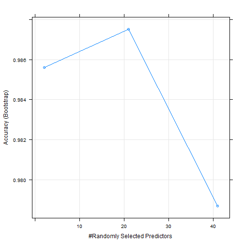

Pracitcal Machine Learning - Doug Needham
===================================================
# Prediction Exercise 
####  Practical Machine Learning Course Project
===================================================
## Synopsis:
The goal of this project is to predict the manner of  unilateral dumbbell biceps curls based on data from various accelerometers on the arm,forearm, belt,  and dumbell of 6 participants. The 5 possible methods include -
* A: exactly according to the specification
* B: throwing the elbows to the front
* C: lifting the dumbbell only halfway
* D: lowering the dumbbell only halfway
* E: throwing the hips to the front

    After scrubbing the data set to remove variables with high rate of NA values, non-accelerometer variables, and employing cross validation to eliminate highly correlated variables, the resulting model was created using 41 of the original 159 columns.
    Since there are a large number of variables to create the model with, a Random Forest model was selected because of its ability to handle many variables and high accuracy rate of selecting predictors.
    The out-of-bag estimate, which is the estimated error rate for future predictions in the test set was 0.77% and resulted in perfectly predicting the actual test set of 20 records that were submitted for this assignment.
    However, since Random Forests are prone to overfit the sample, cross validation was employed to gain a more accurate estimate of what the out-of-sample error truly is for this model.

#### Load libraries and set working directory

```r
# getwd()
setwd("~/Coursera_DataScience/ML")
library(Hmisc)
```

```
## Loading required package: grid
## Loading required package: lattice
## Loading required package: survival
## Loading required package: splines
## Loading required package: Formula
## 
## Attaching package: 'Hmisc'
## 
## The following objects are masked from 'package:base':
## 
##     format.pval, round.POSIXt, trunc.POSIXt, units
```

```r
library(AppliedPredictiveModeling)
library(randomForest)
```

```
## randomForest 4.6-7
## Type rfNews() to see new features/changes/bug fixes.
## 
## Attaching package: 'randomForest'
## 
## The following object is masked from 'package:Hmisc':
## 
##     combine
```

```r
library(ggplot2)
library(caret)
```

```
## 
## Attaching package: 'caret'
## 
## The following object is masked from 'package:survival':
## 
##     cluster
```


====================================

#### Load data

```r
trainDataFile <- "pml-training.csv"
testDataFile <- "pml-testing.csv"

init <- read.csv(trainDataFile, header = TRUE, nrows = 10000, stringsAsFactors = FALSE, na.strings = "NA", quote="")
classes <- sapply(init,class)
rawTrain <- read.csv(trainDataFile, colClasses=classes, header = TRUE)
rawTest <- read.csv(testDataFile, colClasses=classes, header = TRUE)
```

#### Display the structure of the data

```
## 'data.frame':	19622 obs. of  160 variables:
##  $ X                       : chr  "1" "2" "3" "4" ...
##  $ user_name               : chr  "carlitos" "carlitos" "carlitos" "carlitos" ...
##  $ raw_timestamp_part_1    : int  1323084231 1323084231 1323084231 1323084232 1323084232 1323084232 1323084232 1323084232 1323084232 1323084232 ...
##  $ raw_timestamp_part_2    : int  788290 808298 820366 120339 196328 304277 368296 440390 484323 484434 ...
##  $ cvtd_timestamp          : chr  "05/12/2011 11:23" "05/12/2011 11:23" "05/12/2011 11:23" "05/12/2011 11:23" ...
##  $ new_window              : chr  "no" "no" "no" "no" ...
##  $ num_window              : int  11 11 11 12 12 12 12 12 12 12 ...
##  $ roll_belt               : num  1.41 1.41 1.42 1.48 1.48 1.45 1.42 1.42 1.43 1.45 ...
##  $ pitch_belt              : num  8.07 8.07 8.07 8.05 8.07 8.06 8.09 8.13 8.16 8.17 ...
##  $ yaw_belt                : num  -94.4 -94.4 -94.4 -94.4 -94.4 -94.4 -94.4 -94.4 -94.4 -94.4 ...
##  $ total_accel_belt        : int  3 3 3 3 3 3 3 3 3 3 ...
##  $ kurtosis_roll_belt      : chr  "" "" "" "" ...
##  $ kurtosis_picth_belt     : chr  "" "" "" "" ...
##  $ kurtosis_yaw_belt       : chr  "" "" "" "" ...
##  $ skewness_roll_belt      : chr  "" "" "" "" ...
##  $ skewness_roll_belt.1    : chr  "" "" "" "" ...
##  $ skewness_yaw_belt       : chr  "" "" "" "" ...
##  $ max_roll_belt           : num  NA NA NA NA NA NA NA NA NA NA ...
##  $ max_picth_belt          : int  NA NA NA NA NA NA NA NA NA NA ...
##  $ max_yaw_belt            : chr  "" "" "" "" ...
##  $ min_roll_belt           : num  NA NA NA NA NA NA NA NA NA NA ...
##  $ min_pitch_belt          : int  NA NA NA NA NA NA NA NA NA NA ...
##  $ min_yaw_belt            : chr  "" "" "" "" ...
##  $ amplitude_roll_belt     : num  NA NA NA NA NA NA NA NA NA NA ...
##  $ amplitude_pitch_belt    : int  NA NA NA NA NA NA NA NA NA NA ...
##  $ amplitude_yaw_belt      : chr  "" "" "" "" ...
##  $ var_total_accel_belt    : num  NA NA NA NA NA NA NA NA NA NA ...
##  $ avg_roll_belt           : num  NA NA NA NA NA NA NA NA NA NA ...
##  $ stddev_roll_belt        : num  NA NA NA NA NA NA NA NA NA NA ...
##  $ var_roll_belt           : num  NA NA NA NA NA NA NA NA NA NA ...
##  $ avg_pitch_belt          : num  NA NA NA NA NA NA NA NA NA NA ...
##  $ stddev_pitch_belt       : num  NA NA NA NA NA NA NA NA NA NA ...
##  $ var_pitch_belt          : num  NA NA NA NA NA NA NA NA NA NA ...
##  $ avg_yaw_belt            : num  NA NA NA NA NA NA NA NA NA NA ...
##  $ stddev_yaw_belt         : num  NA NA NA NA NA NA NA NA NA NA ...
##  $ var_yaw_belt            : num  NA NA NA NA NA NA NA NA NA NA ...
##  $ gyros_belt_x            : num  0 0.02 0 0.02 0.02 0.02 0.02 0.02 0.02 0.03 ...
##  $ gyros_belt_y            : num  0 0 0 0 0.02 0 0 0 0 0 ...
##  $ gyros_belt_z            : num  -0.02 -0.02 -0.02 -0.03 -0.02 -0.02 -0.02 -0.02 -0.02 0 ...
##  $ accel_belt_x            : int  -21 -22 -20 -22 -21 -21 -22 -22 -20 -21 ...
##  $ accel_belt_y            : int  4 4 5 3 2 4 3 4 2 4 ...
##  $ accel_belt_z            : int  22 22 23 21 24 21 21 21 24 22 ...
##  $ magnet_belt_x           : int  -3 -7 -2 -6 -6 0 -4 -2 1 -3 ...
##  $ magnet_belt_y           : int  599 608 600 604 600 603 599 603 602 609 ...
##  $ magnet_belt_z           : int  -313 -311 -305 -310 -302 -312 -311 -313 -312 -308 ...
##  $ roll_arm                : num  -128 -128 -128 -128 -128 -128 -128 -128 -128 -128 ...
##  $ pitch_arm               : num  22.5 22.5 22.5 22.1 22.1 22 21.9 21.8 21.7 21.6 ...
##  $ yaw_arm                 : num  -161 -161 -161 -161 -161 -161 -161 -161 -161 -161 ...
##  $ total_accel_arm         : int  34 34 34 34 34 34 34 34 34 34 ...
##  $ var_accel_arm           : num  NA NA NA NA NA NA NA NA NA NA ...
##  $ avg_roll_arm            : num  NA NA NA NA NA NA NA NA NA NA ...
##  $ stddev_roll_arm         : num  NA NA NA NA NA NA NA NA NA NA ...
##  $ var_roll_arm            : num  NA NA NA NA NA NA NA NA NA NA ...
##  $ avg_pitch_arm           : num  NA NA NA NA NA NA NA NA NA NA ...
##  $ stddev_pitch_arm        : num  NA NA NA NA NA NA NA NA NA NA ...
##  $ var_pitch_arm           : num  NA NA NA NA NA NA NA NA NA NA ...
##  $ avg_yaw_arm             : num  NA NA NA NA NA NA NA NA NA NA ...
##  $ stddev_yaw_arm          : num  NA NA NA NA NA NA NA NA NA NA ...
##  $ var_yaw_arm             : num  NA NA NA NA NA NA NA NA NA NA ...
##  $ gyros_arm_x             : num  0 0.02 0.02 0.02 0 0.02 0 0.02 0.02 0.02 ...
##  $ gyros_arm_y             : num  0 -0.02 -0.02 -0.03 -0.03 -0.03 -0.03 -0.02 -0.03 -0.03 ...
##  $ gyros_arm_z             : num  -0.02 -0.02 -0.02 0.02 0 0 0 0 -0.02 -0.02 ...
##  $ accel_arm_x             : int  -288 -290 -289 -289 -289 -289 -289 -289 -288 -288 ...
##  $ accel_arm_y             : int  109 110 110 111 111 111 111 111 109 110 ...
##  $ accel_arm_z             : int  -123 -125 -126 -123 -123 -122 -125 -124 -122 -124 ...
##  $ magnet_arm_x            : int  -368 -369 -368 -372 -374 -369 -373 -372 -369 -376 ...
##  $ magnet_arm_y            : int  337 337 344 344 337 342 336 338 341 334 ...
##  $ magnet_arm_z            : int  516 513 513 512 506 513 509 510 518 516 ...
##  $ kurtosis_roll_arm       : chr  "" "" "" "" ...
##  $ kurtosis_picth_arm      : chr  "" "" "" "" ...
##  $ kurtosis_yaw_arm        : chr  "" "" "" "" ...
##  $ skewness_roll_arm       : chr  "" "" "" "" ...
##  $ skewness_pitch_arm      : chr  "" "" "" "" ...
##  $ skewness_yaw_arm        : chr  "" "" "" "" ...
##  $ max_roll_arm            : num  NA NA NA NA NA NA NA NA NA NA ...
##  $ max_picth_arm           : num  NA NA NA NA NA NA NA NA NA NA ...
##  $ max_yaw_arm             : int  NA NA NA NA NA NA NA NA NA NA ...
##  $ min_roll_arm            : num  NA NA NA NA NA NA NA NA NA NA ...
##  $ min_pitch_arm           : num  NA NA NA NA NA NA NA NA NA NA ...
##  $ min_yaw_arm             : int  NA NA NA NA NA NA NA NA NA NA ...
##  $ amplitude_roll_arm      : num  NA NA NA NA NA NA NA NA NA NA ...
##  $ amplitude_pitch_arm     : num  NA NA NA NA NA NA NA NA NA NA ...
##  $ amplitude_yaw_arm       : int  NA NA NA NA NA NA NA NA NA NA ...
##  $ roll_dumbbell           : num  13.1 13.1 12.9 13.4 13.4 ...
##  $ pitch_dumbbell          : num  -70.5 -70.6 -70.3 -70.4 -70.4 ...
##  $ yaw_dumbbell            : num  -84.9 -84.7 -85.1 -84.9 -84.9 ...
##  $ kurtosis_roll_dumbbell  : chr  "" "" "" "" ...
##  $ kurtosis_picth_dumbbell : chr  "" "" "" "" ...
##  $ kurtosis_yaw_dumbbell   : chr  "" "" "" "" ...
##  $ skewness_roll_dumbbell  : chr  "" "" "" "" ...
##  $ skewness_pitch_dumbbell : chr  "" "" "" "" ...
##  $ skewness_yaw_dumbbell   : chr  "" "" "" "" ...
##  $ max_roll_dumbbell       : num  NA NA NA NA NA NA NA NA NA NA ...
##  $ max_picth_dumbbell      : num  NA NA NA NA NA NA NA NA NA NA ...
##  $ max_yaw_dumbbell        : chr  "" "" "" "" ...
##  $ min_roll_dumbbell       : num  NA NA NA NA NA NA NA NA NA NA ...
##  $ min_pitch_dumbbell      : num  NA NA NA NA NA NA NA NA NA NA ...
##  $ min_yaw_dumbbell        : chr  "" "" "" "" ...
##  $ amplitude_roll_dumbbell : num  NA NA NA NA NA NA NA NA NA NA ...
##   [list output truncated]
```

#### missing values

Check for NA's because they can cause issues with models.


```r
nas <- format(sum(is.na(rawTrain)),big.mark=",",scientific=FALSE)
records <- format(nrow(rawTrain),big.mark=",",scientific=FALSE)
paste("From ",records,"records, there are",nas,"incomplete records!")
```

```
## [1] "From  19,622 records, there are 1,287,472 incomplete records!"
```

#### Scrub data

Missing data, highly correlated data and any columns with values near zero are removed from the dataset since they add very little predictive value.


```r
# remove unnecessary fields, and create new dataframe for transformations starting with classe column and non-accelerometer variables
tidy.df <- rawTrain[,c(160,8:159)]

# adding activity as factor variable of classe, and then excluding classe
tidy.df$activity <- factor(tidy.df$classe)

# now discarding classe character variable and putting factor activity in first column
tidy.df <- tidy.df[,c(154,2:153)]

# likewise removing non-accelerometer and also problem_id columns from Test set
tidy.dfTest <- rawTest[,c(8:159)]

# some of the measurements did not contain NA in data file so were converted to character.
maxNas <- .9*nrow(tidy.df[,])
for(col in names(tidy.df)){
  if(is.character(tidy.df[,col])==TRUE
    && col %in% c("user_name","cvtd_timestamp","new_window","classe") == FALSE
     ){
    # Finding those and changing back to numeric.
    tidy.df[,col] <- as.numeric(tidy.df[,col])
    tidy.dfTest[,col] <- as.numeric(tidy.dfTest[,col])
  }
  # Also, remove any cols that are mostly NA altogether since not very useful for prediction
  rowNas <- sum(is.na(tidy.df[,col]))
  if(rowNas > maxNas){
    tidy.df <- tidy.df[,-which(names(tidy.df) %in% c(col))]
    tidy.dfTest <- tidy.dfTest[,-which(names(tidy.dfTest) %in% c(col))]
  }
}
```

```
## Warning: NAs introduced by coercion
## Warning: NAs introduced by coercion
## Warning: NAs introduced by coercion
## Warning: NAs introduced by coercion
## Warning: NAs introduced by coercion
## Warning: NAs introduced by coercion
## Warning: NAs introduced by coercion
## Warning: NAs introduced by coercion
## Warning: NAs introduced by coercion
## Warning: NAs introduced by coercion
## Warning: NAs introduced by coercion
## Warning: NAs introduced by coercion
## Warning: NAs introduced by coercion
## Warning: NAs introduced by coercion
## Warning: NAs introduced by coercion
## Warning: NAs introduced by coercion
## Warning: NAs introduced by coercion
## Warning: NAs introduced by coercion
## Warning: NAs introduced by coercion
## Warning: NAs introduced by coercion
## Warning: NAs introduced by coercion
## Warning: NAs introduced by coercion
## Warning: NAs introduced by coercion
## Warning: NAs introduced by coercion
## Warning: NAs introduced by coercion
## Warning: NAs introduced by coercion
## Warning: NAs introduced by coercion
## Warning: NAs introduced by coercion
## Warning: NAs introduced by coercion
## Warning: NAs introduced by coercion
## Warning: NAs introduced by coercion
## Warning: NAs introduced by coercion
## Warning: NAs introduced by coercion
```

```r
# remove near zero values, if any
nsv <- nearZeroVar(tidy.df[,2:53],saveMetrics=TRUE)
# check if any are TRUE, which none are
nsv[,nsv$nzv==TRUE]
```

```
## data frame with 0 columns and 52 rows
```

```r
# check for highly correlated predictors and remove those columns from both sets
M = abs(cor(tidy.df[,2:53]))
diag(M) <- 0
corPreds <- which(M > 0.9,arr.ind=TRUE)
for(col in unique(row.names(corPreds))){
  tidy.df <- tidy.df[,-which(names(tidy.df) %in% c(col))]
  tidy.dfTest <- tidy.dfTest[,-which(names(tidy.dfTest) %in% c(col))]
}


summary(tidy.df)
```

```
##  activity    yaw_belt       gyros_belt_x      gyros_belt_y    
##  A:5580   Min.   :-180.0   Min.   :-1.0400   Min.   :-0.6400  
##  B:3797   1st Qu.: -88.3   1st Qu.:-0.0300   1st Qu.: 0.0000  
##  C:3422   Median : -13.0   Median : 0.0300   Median : 0.0200  
##  D:3216   Mean   : -11.2   Mean   :-0.0056   Mean   : 0.0396  
##  E:3607   3rd Qu.:  12.9   3rd Qu.: 0.1100   3rd Qu.: 0.1100  
##           Max.   : 179.0   Max.   : 2.2200   Max.   : 0.6400  
##   gyros_belt_z    magnet_belt_x   magnet_belt_y magnet_belt_z 
##  Min.   :-1.460   Min.   :-52.0   Min.   :354   Min.   :-623  
##  1st Qu.:-0.200   1st Qu.:  9.0   1st Qu.:581   1st Qu.:-375  
##  Median :-0.100   Median : 35.0   Median :601   Median :-320  
##  Mean   :-0.130   Mean   : 55.6   Mean   :594   Mean   :-346  
##  3rd Qu.:-0.020   3rd Qu.: 59.0   3rd Qu.:610   3rd Qu.:-306  
##  Max.   : 1.620   Max.   :485.0   Max.   :673   Max.   : 293  
##     roll_arm        pitch_arm         yaw_arm        total_accel_arm
##  Min.   :-180.0   Min.   :-88.80   Min.   :-180.00   Min.   : 1.0   
##  1st Qu.: -31.8   1st Qu.:-25.90   1st Qu.: -43.10   1st Qu.:17.0   
##  Median :   0.0   Median :  0.00   Median :   0.00   Median :27.0   
##  Mean   :  17.8   Mean   : -4.61   Mean   :  -0.62   Mean   :25.5   
##  3rd Qu.:  77.3   3rd Qu.: 11.20   3rd Qu.:  45.88   3rd Qu.:33.0   
##  Max.   : 180.0   Max.   : 88.50   Max.   : 180.00   Max.   :66.0   
##   gyros_arm_z     accel_arm_x      accel_arm_y      accel_arm_z    
##  Min.   :-2.33   Min.   :-404.0   Min.   :-318.0   Min.   :-636.0  
##  1st Qu.:-0.07   1st Qu.:-242.0   1st Qu.: -54.0   1st Qu.:-143.0  
##  Median : 0.23   Median : -44.0   Median :  14.0   Median : -47.0  
##  Mean   : 0.27   Mean   : -60.2   Mean   :  32.6   Mean   : -71.2  
##  3rd Qu.: 0.72   3rd Qu.:  84.0   3rd Qu.: 139.0   3rd Qu.:  23.0  
##  Max.   : 3.02   Max.   : 437.0   Max.   : 308.0   Max.   : 292.0  
##   magnet_arm_x   magnet_arm_y   magnet_arm_z  roll_dumbbell   
##  Min.   :-584   Min.   :-392   Min.   :-597   Min.   :-153.7  
##  1st Qu.:-300   1st Qu.:  -9   1st Qu.: 131   1st Qu.: -18.5  
##  Median : 289   Median : 202   Median : 444   Median :  48.2  
##  Mean   : 192   Mean   : 157   Mean   : 306   Mean   :  23.8  
##  3rd Qu.: 637   3rd Qu.: 323   3rd Qu.: 545   3rd Qu.:  67.6  
##  Max.   : 782   Max.   : 583   Max.   : 694   Max.   : 153.6  
##  pitch_dumbbell    yaw_dumbbell     total_accel_dumbbell gyros_dumbbell_y
##  Min.   :-149.6   Min.   :-150.87   Min.   : 0.0         Min.   :-2.10   
##  1st Qu.: -40.9   1st Qu.: -77.64   1st Qu.: 4.0         1st Qu.:-0.14   
##  Median : -21.0   Median :  -3.32   Median :10.0         Median : 0.03   
##  Mean   : -10.8   Mean   :   1.67   Mean   :13.7         Mean   : 0.05   
##  3rd Qu.:  17.5   3rd Qu.:  79.64   3rd Qu.:19.0         3rd Qu.: 0.21   
##  Max.   : 149.4   Max.   : 154.95   Max.   :58.0         Max.   :52.00   
##  accel_dumbbell_x accel_dumbbell_y accel_dumbbell_z magnet_dumbbell_x
##  Min.   :-419.0   Min.   :-189.0   Min.   :-334.0   Min.   :-643     
##  1st Qu.: -50.0   1st Qu.:  -8.0   1st Qu.:-142.0   1st Qu.:-535     
##  Median :  -8.0   Median :  41.5   Median :  -1.0   Median :-479     
##  Mean   : -28.6   Mean   :  52.6   Mean   : -38.3   Mean   :-328     
##  3rd Qu.:  11.0   3rd Qu.: 111.0   3rd Qu.:  38.0   3rd Qu.:-304     
##  Max.   : 235.0   Max.   : 315.0   Max.   : 318.0   Max.   : 592     
##  magnet_dumbbell_y magnet_dumbbell_z  roll_forearm     pitch_forearm   
##  Min.   :-3600     Min.   :-262.0    Min.   :-180.00   Min.   :-72.50  
##  1st Qu.:  231     1st Qu.: -45.0    1st Qu.:  -0.74   1st Qu.:  0.00  
##  Median :  311     Median :  13.0    Median :  21.70   Median :  9.24  
##  Mean   :  221     Mean   :  46.1    Mean   :  33.83   Mean   : 10.71  
##  3rd Qu.:  390     3rd Qu.:  95.0    3rd Qu.: 140.00   3rd Qu.: 28.40  
##  Max.   :  633     Max.   : 452.0    Max.   : 180.00   Max.   : 89.80  
##   yaw_forearm     total_accel_forearm gyros_forearm_x   gyros_forearm_y 
##  Min.   :-180.0   Min.   :  0.0       Min.   :-22.000   Min.   : -7.02  
##  1st Qu.: -68.6   1st Qu.: 29.0       1st Qu.: -0.220   1st Qu.: -1.46  
##  Median :   0.0   Median : 36.0       Median :  0.050   Median :  0.03  
##  Mean   :  19.2   Mean   : 34.7       Mean   :  0.158   Mean   :  0.08  
##  3rd Qu.: 110.0   3rd Qu.: 41.0       3rd Qu.:  0.560   3rd Qu.:  1.62  
##  Max.   : 180.0   Max.   :108.0       Max.   :  3.970   Max.   :311.00  
##  accel_forearm_x  accel_forearm_y accel_forearm_z  magnet_forearm_x
##  Min.   :-498.0   Min.   :-632    Min.   :-446.0   Min.   :-1280   
##  1st Qu.:-178.0   1st Qu.:  57    1st Qu.:-182.0   1st Qu.: -616   
##  Median : -57.0   Median : 201    Median : -39.0   Median : -378   
##  Mean   : -61.7   Mean   : 164    Mean   : -55.3   Mean   : -313   
##  3rd Qu.:  76.0   3rd Qu.: 312    3rd Qu.:  26.0   3rd Qu.:  -73   
##  Max.   : 477.0   Max.   : 923    Max.   : 291.0   Max.   :  672   
##  magnet_forearm_y magnet_forearm_z
##  Min.   :-896     Min.   :-973    
##  1st Qu.:   2     1st Qu.: 191    
##  Median : 591     Median : 511    
##  Mean   : 380     Mean   : 394    
##  3rd Qu.: 737     3rd Qu.: 653    
##  Max.   :1480     Max.   :1090
```

```r
# data should be good enough now but will check NAs one more time
```

#### Check for missing values on tidied dataset

```r
nas <- format(sum(is.na(tidy.df)),big.mark=",",scientific=FALSE)
records <- format(nrow(tidy.df),big.mark=",",scientific=FALSE)
paste("Of",records,"records, there are",nas,"incomplete records!")
```

```
## [1] "Of 19,622 records, there are 0 incomplete records!"
```

#### Build random forest model on all accelerometer variables

The random forest model was selected because of its high accuracy rate and ability to drill down into many variables in order to identify which ones contribute most to a prediction algorithm. This resulting out-of-bag estimate of error rate was 0.77%.


```r
# split Training into train/test sets
in.Train = createDataPartition(tidy.df$activity, p = 3/4, list=FALSE)
training = tidy.df[in.Train,]
testing = tidy.df[-in.Train,]

# use Random Forest model due to more than 2 outcome variables
modFit <- train(activity ~.,method="rf", data=training)
```

```
## 
## Attaching package: 'e1071'
## 
## The following object is masked from 'package:Hmisc':
## 
##     impute
```

```r
finMod <- modFit$finalModel
finMod
```

```
## 
## Call:
##  randomForest(x = x, y = y, mtry = param$mtry) 
##                Type of random forest: classification
##                      Number of trees: 500
## No. of variables tried at each split: 21
## 
##         OOB estimate of  error rate: 0.71%
## Confusion matrix:
##      A    B    C    D    E class.error
## A 4175    7    1    0    2    0.002389
## B   15 2824    7    0    2    0.008427
## C    0   19 2533   15    0    0.013245
## D    1    0   22 2386    3    0.010779
## E    0    0    3    7 2696    0.003695
```

```r
summary(finMod)
```

```
##                 Length Class      Mode     
## call                4  -none-     call     
## type                1  -none-     character
## predicted       14718  factor     numeric  
## err.rate         3000  -none-     numeric  
## confusion          30  -none-     numeric  
## votes           73590  matrix     numeric  
## oob.times       14718  -none-     numeric  
## classes             5  -none-     character
## importance         41  -none-     numeric  
## importanceSD        0  -none-     NULL     
## localImportance     0  -none-     NULL     
## proximity           0  -none-     NULL     
## ntree               1  -none-     numeric  
## mtry                1  -none-     numeric  
## forest             14  -none-     list     
## y               14718  factor     numeric  
## test                0  -none-     NULL     
## inbag               0  -none-     NULL     
## xNames             41  -none-     character
## problemType         1  -none-     character
## tuneValue           1  data.frame list     
## obsLevels           5  -none-     character
```

```r
# view Importance of each variable
varImp(modFit)
```

```
## rf variable importance
## 
##   only 20 most important variables shown (out of 41)
## 
##                      Overall
## yaw_belt               100.0
## pitch_forearm           76.8
## magnet_dumbbell_z       64.9
## magnet_dumbbell_y       49.4
## magnet_belt_y           47.6
## roll_forearm            46.4
## magnet_belt_z           32.6
## roll_dumbbell           28.6
## gyros_belt_z            27.0
## magnet_dumbbell_x       25.1
## accel_dumbbell_y        22.6
## roll_arm                20.7
## accel_forearm_z         20.6
## total_accel_dumbbell    17.6
## accel_forearm_x         17.6
## magnet_belt_x           17.2
## accel_dumbbell_z        16.9
## magnet_forearm_z        16.3
## yaw_arm                 13.5
## yaw_dumbbell            13.1
```

```r
importance(finMod)
```

```
##                      MeanDecreaseGini
## yaw_belt                      1282.60
## gyros_belt_x                    76.51
## gyros_belt_y                    84.13
## gyros_belt_z                   377.55
## magnet_belt_x                  255.79
## magnet_belt_y                  633.39
## magnet_belt_z                  446.89
## roll_arm                       299.95
## pitch_arm                      137.25
## yaw_arm                        209.79
## total_accel_arm                 71.55
## gyros_arm_z                     42.89
## accel_arm_x                    147.03
## accel_arm_y                    137.81
## accel_arm_z                     86.52
## magnet_arm_x                   191.33
## magnet_arm_y                   143.05
## magnet_arm_z                   123.66
## roll_dumbbell                  396.94
## pitch_dumbbell                 108.97
## yaw_dumbbell                   205.35
## total_accel_dumbbell           261.42
## gyros_dumbbell_y               186.48
## accel_dumbbell_x               133.73
## accel_dumbbell_y               323.47
## accel_dumbbell_z               252.72
## magnet_dumbbell_x              354.28
## magnet_dumbbell_y              655.08
## magnet_dumbbell_z              847.28
## roll_forearm                   617.77
## pitch_forearm                  995.08
## yaw_forearm                    126.69
## total_accel_forearm             66.36
## gyros_forearm_x                 47.98
## gyros_forearm_y                106.22
## accel_forearm_x                261.21
## accel_forearm_y                 91.08
## accel_forearm_z                298.67
## magnet_forearm_x               141.51
## magnet_forearm_y               164.66
## magnet_forearm_z               245.11
```

#### Perform cross validation

Since random forests can lead to overfitting, cross validation is used to determine a better estimate the of out of sample error by running the model on smaller subsets of the training datasetThis resulted in projecting an 84% accuracy rate for out-of-bag predictions, which is quite a bit lower than the model's estimation of 99.23%.


```r
# use Random Forest Cross Validation
result <- rfcv(training[,2:41], training$activity, cv.fold=10, scale="log", step=0.5,
     mtry=function(p) max(1, floor(sqrt(p))), recursive=FALSE)

# Plot of cross validation error results
with(result,
     plot(n.var, error.cv, log="x", type="o", lwd=2,
          xlab="Number of Variables",
          ylab="Error rates at each step",
          main="Random Cross Validation Error Rate by number of Variables used in Model")
     )
```

 

```r
# Average OOB estimate of error rate across 10 folds
mean(result$error.cv)
```

```
## [1] 0.1608
```

```r
# Estimate OOB Accuracy rate based on cross validation
1-mean(result$error.cv)
```

```
## [1] 0.8392
```

#### Plots for model

These plots the order of importance of the variables used in creating the model  and demonstrate the accuracy of the model.


```r
plot(modFit, log="y")
```

 

```r
varImpPlot(finMod)
```

 

#### Run on test partition set to compare actual vs prediction

```r
pred <- as.character(predict(modFit,testing))
# cbind(as.character(testing$activity),pred)
testing$predRight <- pred==testing$activity
# results on the testing set
table(pred,testing$activity)
```

```
##     
## pred    A    B    C    D    E
##    A 1394    4    0    0    0
##    B    1  944    5    0    0
##    C    0    0  847    9    0
##    D    0    0    3  795    5
##    E    0    1    0    0  896
```

#### Run on real test set for part 2 of assignment

```r
# run on test
predTest <- as.character(predict(modFit,tidy.dfTest))
predTest
```

```
##  [1] "B" "A" "B" "A" "A" "E" "D" "B" "A" "A" "B" "C" "B" "A" "E" "E" "A"
## [18] "B" "B" "B"
```

```r
tidy.dfTestPred <- cbind(activity=predTest,tidy.dfTest)
tidy.dfTestPred
```

```
##    activity yaw_belt gyros_belt_x gyros_belt_y gyros_belt_z magnet_belt_x
## 1         B    -4.75        -0.50        -0.02        -0.46           -13
## 2         A   -88.90        -0.06        -0.02        -0.07            43
## 3         B   -88.50         0.05         0.02         0.03            29
## 4         A   162.00         0.11         0.11        -0.16           169
## 5         A   -88.60         0.03         0.02         0.00            33
## 6         E   -87.70         0.10         0.05        -0.13            31
## 7         D   -87.30        -0.06         0.00         0.00            50
## 8         B   -88.50        -0.18        -0.02        -0.03            39
## 9         A   -93.70         0.10         0.00        -0.02            -6
## 10        A   -13.10         0.14         0.11        -0.16            10
## 11        B   -92.70         0.05         0.00         0.00             6
## 12        C   -87.80        -0.10         0.00         0.02            51
## 13        B   -88.60        -0.06         0.00        -0.13            34
## 14        A   -87.90        -0.05         0.00         0.00            55
## 15        E   -80.30         0.24         0.00         0.05            91
## 16        E   -87.00         0.02         0.02         0.00            45
## 17        A     1.84        -0.50         0.00        -0.48             4
## 18        B   -93.10         0.02         0.00        -0.05             0
## 19        B    -2.68        -0.31        -0.05        -0.44            -5
## 20        B   -88.70         0.06        -0.02         0.02            37
##    magnet_belt_y magnet_belt_z roll_arm pitch_arm yaw_arm total_accel_arm
## 1            581          -382    40.70    -27.80   178.0              10
## 2            636          -309     0.00      0.00     0.0              38
## 3            631          -312     0.00      0.00     0.0              44
## 4            608          -304  -109.00     55.00  -142.0              25
## 5            566          -418    76.10      2.76   102.0              29
## 6            638          -291     0.00      0.00     0.0              14
## 7            622          -315     0.00      0.00     0.0              15
## 8            635          -305     0.00      0.00     0.0              22
## 9            600          -302  -137.00     11.20  -167.0              34
## 10           601          -330   -82.40    -63.80   -75.3              32
## 11           599          -312    70.00     15.10   113.0              33
## 12           632          -308     0.00      0.00     0.0              30
## 13           571          -426   110.00    -31.70   -13.6              23
## 14           635          -305     0.00      0.00     0.0              37
## 15           584          -398     0.00      0.00     0.0              23
## 16           566          -425    88.10      5.58   123.0              33
## 17           566          -400    -1.47     -3.45   -55.1               3
## 18           607          -305   152.00    -26.40   -85.0              42
## 19           584          -366    30.70    -27.00  -151.0              11
## 20           567          -425    90.60     11.50   117.0              30
##    gyros_arm_z accel_arm_x accel_arm_y accel_arm_z magnet_arm_x
## 1        -0.18          16          38          93         -326
## 2        -0.43        -290         215         -90         -325
## 3         1.13        -341         245         -87         -264
## 4         0.92        -238         -57           6         -173
## 5        -0.54        -197         200         -30         -170
## 6        -0.07         -26         130         -19          396
## 7         0.89          99          79         -67          702
## 8        -0.69         -98         175         -78          535
## 9        -0.02        -287         111        -122         -367
## 10        0.79        -301         -42         -80         -420
## 11        0.00        -277         113        -112         -320
## 12        0.79        -192         204         -75          194
## 13       -0.15         106          97        -168          697
## 14       -0.10        -277         157        -183         -404
## 15        0.49          41          85        -204          750
## 16        0.10        -236         163        -148         -398
## 17        0.13           2          -9          27         -394
## 18       -0.03          35         -65        -404          202
## 19       -0.44          -7          57          89         -266
## 20       -0.18        -223         166        -105         -428
##    magnet_arm_y magnet_arm_z roll_dumbbell pitch_dumbbell yaw_dumbbell
## 1           385          481       -17.737          24.96      126.236
## 2           447          434        54.478         -53.70      -75.515
## 3           474          413        57.070         -51.37      -75.203
## 4           257          633        43.109         -30.05     -103.320
## 5           275          617      -101.384         -53.44      -14.195
## 6           176          516        62.187         -50.56      -71.121
## 7            15          217        56.046         -53.97      -73.871
## 8           215          385        59.128         -51.30      -73.368
## 9           335          520       122.524           0.00       34.556
## 10          294          493      -111.118         -31.91       31.906
## 11          350          514       123.984         -32.07        7.889
## 12          280          555        45.507         -53.71      -83.050
## 13         -184         -175        12.480          34.28      120.425
## 14          416          409        56.371         -49.97      -77.029
## 15          -24          -58        46.328         -54.97      -81.275
## 16          288          525        57.796          33.72       87.799
## 17          321          502       -28.497          13.61      125.331
## 18         -307         -499       107.472         -49.54       -2.377
## 19          454          441        -7.463          23.65      132.234
## 20          321          472        36.917          96.87       45.178
##    total_accel_dumbbell gyros_dumbbell_y accel_dumbbell_x accel_dumbbell_y
## 1                     9             0.06               21              -15
## 2                    31             0.05             -153              155
## 3                    29             0.14             -141              155
## 4                    18            -0.02              -51               72
## 5                     4            -0.47              -18              -30
## 6                    29             0.80             -138              166
## 7                    29             0.16             -145              150
## 8                    29             0.14             -140              159
## 9                     3            -0.21                0               25
## 10                    2             0.51               -7              -20
## 11                    1            -0.47               -4               12
## 12                   30            -0.10             -149              128
## 13                    8            -1.11               27               10
## 14                   30             0.11             -139              155
## 15                   31            -0.21             -159              136
## 16                   13             0.92               43               71
## 17                   11            -0.11               14              -29
## 18                    4             1.91              -20               37
## 19                   10            -0.10               22               -7
## 20                   23            -0.79              185               81
##    accel_dumbbell_z magnet_dumbbell_x magnet_dumbbell_y magnet_dumbbell_z
## 1                81               523              -528               -56
## 2              -205              -502               388               -36
## 3              -196              -506               349                41
## 4              -148              -576               238                53
## 5                -5              -424               252               312
## 6              -186              -543               262                96
## 7              -190              -484               354                97
## 8              -191              -515               350                53
## 9                 9              -519               348               -32
## 10                7              -531               321              -164
## 11                1              -556               280               -23
## 12             -215              -539               293                67
## 13               75              -328               271               363
## 14             -202              -523               337                46
## 15             -221              -511               323                85
## 16              100              -284               311               368
## 17               98               484              -558               -19
## 18               -1              -527               329               -77
## 19               91               505              -537               -86
## 20               98               272               403               340
##    roll_forearm pitch_forearm yaw_forearm total_accel_forearm
## 1         141.0         49.30       156.0                  33
## 2         109.0        -17.60       106.0                  39
## 3         131.0        -32.60        93.0                  34
## 4           0.0          0.00         0.0                  43
## 5        -176.0         -2.16       -47.9                  24
## 6         150.0          1.46        89.7                  43
## 7         155.0         34.50       152.0                  32
## 8        -161.0         43.60       -89.5                  47
## 9          15.5        -63.50      -139.0                  36
## 10         13.2         19.40      -105.0                  24
## 11        137.0         -9.41       104.0                  46
## 12        138.0        -19.90        70.5                  36
## 13        176.0         16.70       -38.5                  23
## 14         53.1        -46.20       159.0                  33
## 15        152.0         26.50      -168.0                  24
## 16       -176.0         16.20       -42.2                  25
## 17         79.4         -2.60       109.0                  30
## 18       -173.0         49.80      -133.0                  25
## 19       -164.0         59.30      -149.0                  23
## 20        173.0         19.20       -83.2                  21
##    gyros_forearm_x gyros_forearm_y accel_forearm_x accel_forearm_y
## 1             0.74           -3.34            -110             267
## 2             1.12           -2.78             212             297
## 3             0.18           -0.79             154             271
## 4             1.38            0.69             -92             406
## 5            -0.75            3.10             131             -93
## 6            -0.88            4.26             230             322
## 7            -0.53            1.80            -192             170
## 8             0.63           -0.74            -151            -331
## 9             0.03            0.02             195             204
## 10            0.02            0.13            -212              98
## 11            0.05            0.05              -3             405
## 12           -0.02            0.83             182             263
## 13            0.00           -4.69             149              46
## 14            0.02            0.00             232             106
## 15            0.64           -5.97             -18              43
## 16           -0.31           -3.45             161             -61
## 17            0.10           -0.06             144             201
## 18           -0.75            4.14            -129             -29
## 19           -1.06            2.79            -148              21
## 20           -1.01            3.18              41            -100
##    accel_forearm_z magnet_forearm_x magnet_forearm_y magnet_forearm_z
## 1             -149             -714              419              617
## 2             -118             -237              791              873
## 3             -129              -51              698              783
## 4              -39             -233              783              521
## 5              172              375             -787               91
## 6             -144             -300              800              884
## 7             -175             -678              284              585
## 8             -282             -109             -619              -32
## 9             -217                0              652              469
## 10              -7             -403              723              512
## 11            -203             -248              720              438
## 12            -148               32              648              702
## 13             167              456             -677               29
## 14            -198              123              555              648
## 15            -226             -540             -155              389
## 16             171              532             -775              114
## 17            -154             -146              756              708
## 18            -202             -500             -232              329
## 19            -172             -614              -46              471
## 20             179               70             -703               74
```


```r
# write answers out to submit project predictions of test set
pml_write_files(predTest)
```
